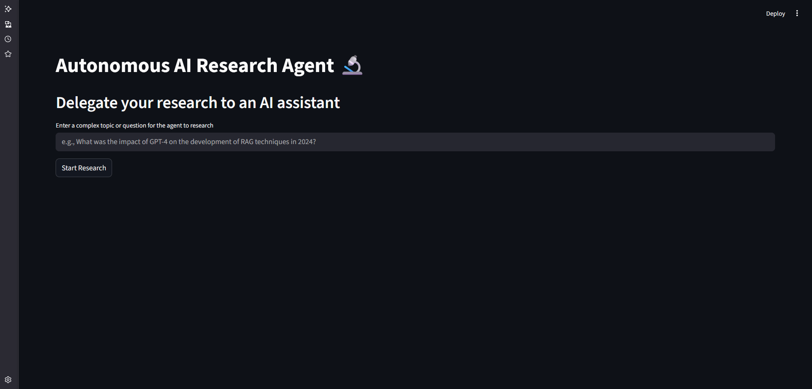
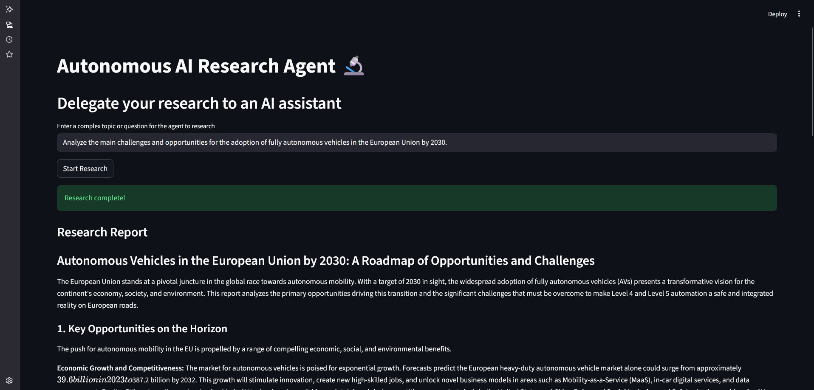

# Autonomous AI Research Agent (LangChain Agents with Gemini Pro)

### An autonomous AI agent that uses Google's Gemini 2.5 Pro and external tools (like web search) to research complex topics and generate comprehensive reports.

 
 
 
 


## 🚀 Overview

This project showcases a senior-level implementation of an **autonomous AI agent**. Unlike traditional Q&A bots, this application takes a high-level research goal from the user and independently formulates a multi-step plan to achieve it. It leverages external tools, such as a web search API, to gather, analyze, and synthesize information before presenting a final, structured report.

This demonstrates an understanding of advanced GenAI concepts like **tool use**, **planning**, and **reasoning**, which are fundamental to building next-generation AI applications.

## ✨ Key Features & Techniques

*   **Autonomous Agents & Tool Use:** The core of the project. The application features an AI agent built with **LangChain** that can autonomously decide which tools to use (e.g., Tavily Search) and in what sequence to fulfill a user's request.
*   **Planning and Reasoning (ReAct Pattern):** The agent implicitly uses a ReAct (Reasoning and Acting) framework, where it "thinks" about the next steps, acts by calling a tool, and observes the results to inform its next action. This process is visible in the terminal (`verbose=True`).
*   **Orchestration with LangChain:** Demonstrates proficiency in using the `langchain` framework to define tools, create complex prompts, and build a robust `AgentExecutor` that manages the entire research workflow.
*   **External API Integration:** Integrates with the **Tavily Search API**, a search engine optimized for LLMs, showcasing the ability to extend an agent's capabilities with external knowledge sources.
*   **End-to-End System Design:** Builds a complete system, from a user-facing **Streamlit** interface to a complex backend agent that handles multi-step, dynamic task execution.

## 🛠️ How to Run

1.  **Clone the repository:**
    ```bash
    git clone https://github.com/takzen/ai-research-agent.git
    cd ai-research-agent
    ```

2.  **Set up API Keys:**
    *   Create a file named `.env` in the root of the project.
    *   Add your API keys to this file:
        ```
        GOOGLE_API_KEY="YOUR_GOOGLE_AI_API_KEY"
        TAVILY_API_KEY="YOUR_TAVILY_API_KEY"
        ```

3.  **Create a virtual environment and install dependencies:**
    *   This project requires Python 3.9+. Create a virtual environment (`uv venv`).
    *   Install the required packages using this command:
        ```bash
        uv pip install streamlit python-dotenv langchain google-generativeai langchain-google-genai tavily-python langchain-community
        ```

4.  **Run the Streamlit application:**
    ```bash
    streamlit run app.py
    ```

## 🖼️ Showcase

| 1. User provides a research topic                          | 2. Agent generates a comprehensive report                 |
| :--------------------------------------------------------- | :-------------------------------------------------------- |
|                     |                |
| *The user inputs a complex query into the Streamlit interface.* | *After performing its research, the agent presents a detailed, structured report as the final output.* |